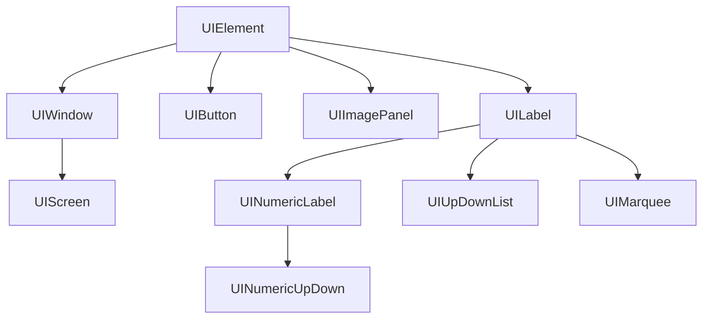

# OaktreeLab::M5LiteUI

This is an experimental and under-development lightweight UI library for the M5Stack series.

## **Installation**

This library is not officially released yet. So, if you want to try it, you need to install manually since automatic installation by Arduino IDE is currently not supported.

Clone this repository to the `src` subfolder within your sketch by the following command:

```
git clone https://github.com/yamamaya/OaktreeLab_M5LiteUI.git
```

Or,  add this library as a submodule to the `src` subfolder within your sketch by the following command:

```
git submodule add https://github.com/yamamaya/OaktreeLab_M5LiteUI
```

## How to use

Here is the most simple example, it shows just a blank screen.

```cpp
#include <M5Unified.h>
#include "src/OaktreeLab_M5LiteUI/OaktreeLab_M5LiteUI.h"

using namespace OaktreeLab::M5LiteUI;

// The main screen
class MainScreen : public UIScreen {
  public:
    MainScreen() {
    }

  protected:
    // Setup main screen
    virtual void setup() override {
    }

    // Update main screen
    virtual void loop() override {
    }

    // Draw main screen
    virtual void draw( DrawingMode dmode ) override {
    }
};

static UIBase *uibase;        // OaktreeLab::M5LiteUI core
static MainScreen *screen;    // An instance of MainScreen

void setup() {
  M5.begin();

  // Initialize M5LiteUI core
  uibase = new UIBase( &M5.Display );

  // Create MainScreen and show
  screen = new MainScreen();
  uibase->setScreen( screen );
}

void loop() {
  M5.update();

  // Update M5LiteUI
  uibase->loop();
}
```

Next, this is the most basic example.

```cpp
#include <M5Unified.h>
#include "src/OaktreeLab_M5LiteUI/OaktreeLab_M5LiteUI.h"

using namespace OaktreeLab::M5LiteUI;

// The main screen
class MainScreen : public UIScreen {
  public:
    MainScreen() {
    }

  private:
    UIMarquee *marquee1;
    UINumericLabel *label1;
    UINumericUpDown *updown1;
    UILabel *label2;
    UIButton *button1;
    UIUpDownList *list1;
    UIImagePanel *imgpanel1;
    int BeepFreq = 800;

  protected:
    // Setup main screen
    virtual void setup() override {
      // Set colors and font to main screen. All child elements inherit them by default.
      this->setForegroundColor( TFT_WHITE );
      this->setBackgroundColor( M5.Lcd.color565( 64, 64, 64 ) );
      this->setFont( &Font2 );

      // Add a decorative text label
      marquee1 = new UIMarquee( this, Rectangle( 20, 20, 280, 30 ), "OaktreeLab::M5LiteUI Demo", MarqueeType::Blink );
      marquee1->setFont( &fonts::FreeMonoBold9pt7b );
      marquee1->setTextAlignment( TextAlignment::MiddleLeft );
      marquee1->setForegroundColor( TFT_GREEN );
      addChild( marquee1 );

      // Add a numeric label
      // Use backbuffers for frequently updated elements like this to reduce unsightly flicker.
      // However, backbuffers require a large amount of memory, so use them sparingly.
      label1 = new UINumericLabel( this, Rectangle( 20, 60, 150, 30 ), true );
      label1->setTextAlignment( TextAlignment::MiddleCenter );
      label1->setBackgroundColor( TFT_NAVY );
      label1->showBorder( true );
      label1->setFormat( "%08X" );
      addChild( label1 );

      // Add a numeric up-down input
      updown1 = new UINumericUpDown( this, Rectangle( 20, 100, 80, 30 ) );
      updown1->setTextAlignment( TextAlignment::MiddleRight );
      updown1->setBackgroundColor( TFT_NAVY );
      updown1->setValueRange( 100, 4000 );
      updown1->setValueStep( 100 );
      updown1->setValue( BeepFreq );
      updown1->setEventCallback( [this](UIElement *sender, ElementEvent event, uint32_t arg) {
        // Callback process called when value changed
        if ( event == ElementEvent::ValueChanged ) {
          BeepFreq = arg;
          M5.Speaker.tone( BeepFreq, 100 );
        }
      } );
      addChild( updown1 );

      label2 = new UILabel( this, Rectangle( 108, 100, 50, 30 ), "Hz" );
      label2->setTextAlignment( TextAlignment::MiddleLeft );
      addChild( label2 );

      // Add a button
      button1 = new UIButton( this, Rectangle( 160, 100, 80, 30 ), "BEEP" );
      button1->setTextAlignment( TextAlignment::MiddleCenter );
      button1->setBackgroundColor( TFT_NAVY );
      button1->setEventCallback( [this](UIElement *sender, ElementEvent event, uint32_t arg) {
        // Callback process called when button pushed
        if ( event == ElementEvent::Clicked ) {
          M5.Speaker.tone( BeepFreq, 500 );
        }
      } );
      addChild( button1 );

      // Add a up-down selectable list
      std::vector<const char*> items = { "Rainbow", "Red", "Green", "Blue" };
      list1 = new UIUpDownList( this, Rectangle( 20, 140, 100, 30 ), items );
      list1->setFont( Font2 );
      list1->setBackgroundColor( TFT_NAVY );
      list1->setIndex( 0 );
      addChild( list1 );

      // Add a image panel
      M5Canvas *canvas = Utils::createM5Canvas( 16, 16, 16 );
      imgpanel1 = new UIImagePanel( this, Rectangle( 160, 140, 50, 50 ), canvas );
      imgpanel1->showBorder( true );
      imgpanel1->setImageAlignment( ImageAlignment::Stretch );
      addChild( imgpanel1 );
    }

    // Update main screen
    virtual void loop() override {
      // Update label1 (UINumericLabel)
      label1->setValue( (int32_t)millis() );

      // Update imgpanel1 (UIImagePanel)
      M5Canvas *canvas = imgpanel1->getImage();
      switch ( list1->getIndex() ) {
        case 0: {
          uint16_t col = (uint16_t)( millis() >> 4 );
          for ( uint16_t t = 0 ; t < 16*2-1 ; t ++ ) {
            canvas->drawLine( t, 0, 0, t, col + t*2 );
          }
          break;
        }
        case 1: {
          canvas->fillRect( 0, 0, 16, 16, TFT_RED );
          break;
        }
        case 2: {
          canvas->fillRect( 0, 0, 16, 16, TFT_GREEN );
          break;
        }
        case 3: {
          canvas->fillRect( 0, 0, 16, 16, TFT_BLUE );
          break;
        }
      }
      imgpanel1->setUpdate();
    }

    // Draw main screen
    virtual void draw( DrawingMode dmode ) override {
      DrawingContext dc = beginDraw();
      // Fill screen and draw a frame only if TotalRedraw is required.
      if ( dmode == DrawingMode::TotalRedraw ) {
        dc.canvas->fillScreen( TFT_BLACK );
        dc.canvas->fillRoundRect( 0, 0, dc.rect.width, dc.rect.height, 15, TFT_CYAN );
        dc.canvas->fillRoundRect( 10, 10, dc.rect.width-20, dc.rect.height-20, 10, bgColor );
      }
      endDraw();
    }
};

static UIBase *uibase;        // OaktreeLab::M5LiteUI core
static MainScreen *screen;    // An instance of MainScreen

void setup() {
  M5.begin();

  // Initialize M5LiteUI core
  uibase = new UIBase( &M5.Display );

  // Create MainScreen and show
  screen = new MainScreen();
  uibase->setScreen( screen );
}

void loop() {
  M5.update();

  // Update M5LiteUI
  uibase->loop();
}
```

## Element classes



## FAQs

### Are there any plans to support richer graphics and animations?

No.

### Are there any plans to support touch panel?

Maybe.

## **Notes**

- This library is under active development and may be subject to changes and bugs.
- Refer to the source file for detailed usage.
